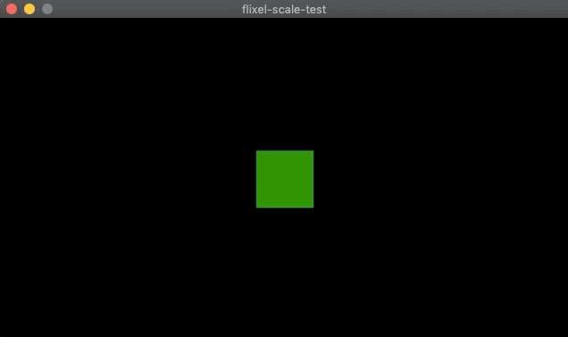

# haxeflixel-pixel-perfect

Just a simple example demonstrating how to achieve "Pixel Perfect" rendering with [Haxeflixel](https://haxeflixel.com), as detailed in this [Gist](https://gist.github.com/AustinEast/108ec6601cf47389fdee81e0014cdc2a).
